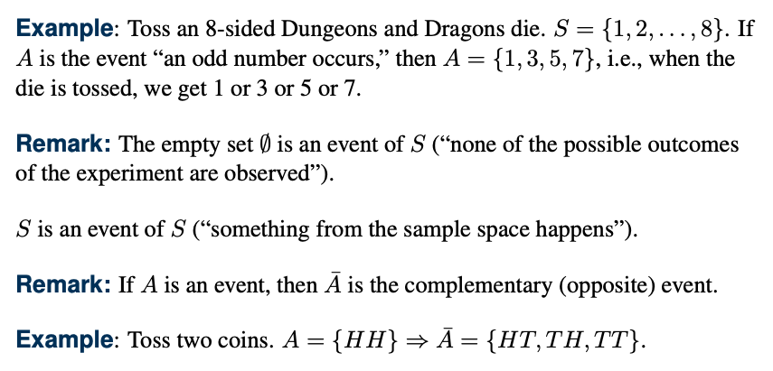

# Getting Started with Probability

## Concept

Definition : A sample space associated with an experiment E is the set of all possible outcomes of E. It's usually denoted by S.

Definition : An event is a set of possible outcomes. Thus, any subset of S is an event.

## What is Probability?

Suppose A is some event from a sample space S. What's the probability that A occur, i.e., P(A)?

